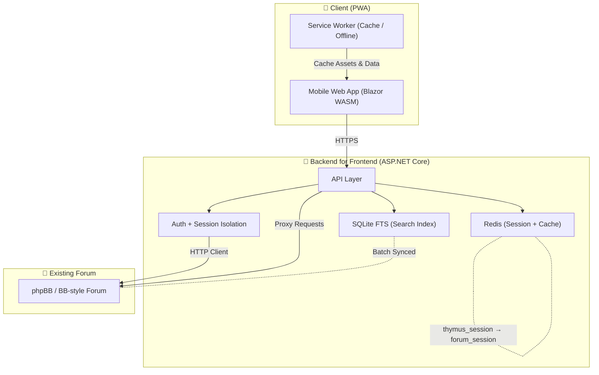

# thymus-pocket

```mermaid
flowchart

subgraph CLIENT["📱 Client (PWA)"]
  UI["Mobile Web App (Blazor WASM)"]
  SW["Service Worker (Cache / Offline)"]
end

subgraph BFF["🧩 Backend for Frontend (ASP.NET Core)"]
  API["API Layer"]
  Auth["Auth + Session Isolation"]
  Cache["Redis (Session + Cache)"]
  Search["SQLite FTS (Search Index)"]
end

subgraph FORUM["💬 Existing Forum"]
  Forum["phpBB / BB-style Forum"]
end

UI -->|HTTPS| API
SW -->|Cache Assets & Data| UI

API --> Auth
API --> Cache
API --> Search

Auth -->|HTTP Client| Forum
API -->|Proxy Requests| Forum

Cache -. "thymus_session → forum_session" .- Cache
Search -. "Batch Synced" .- Forum
```
