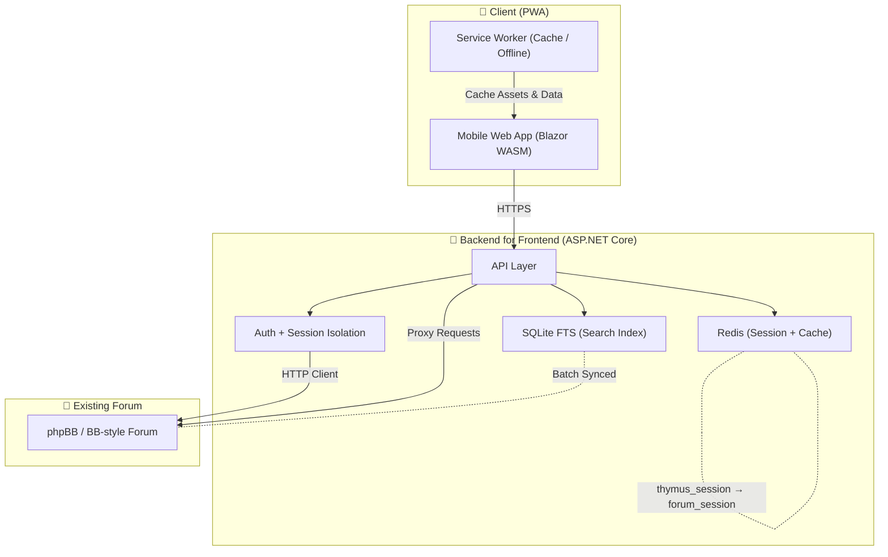

# Thymus Pocket

Thymus Pocket is a mobile-first web client for a private Simple Machines Forum 2.0x.  The goal is to provide a fast, secure, app-like experience on iOS and Android without modifying the existing forum.

The system uses a Backend-for-Frontend (BFF) architecture to isolate the client from legacy systems, enforce security, and allow future evolution.

## Goals

* App-like experience on mobile (installable on iOS / Android)

* Strong security and isolation from the legacy forum

* Fast navigation and search

* Minimal coupling to the forum implementation

* Ability to evolve without breaking the forum

## Non-goals

* Replacing the forum

* Direct database access to the forum

* Real-time guarantees

# Components

* Progressive web app client (PWA)
* Backend for frontend (BFF)
* Internal services
  * Redis
  * SQLite FTS

## Client (PWA)

The client is a Progressive Web App optimized for mobile usage.

#### Characteristics

* Installable on Android and iOS (Add to Home Screen)

* Offline-friendly using Service Worker + Cache API

* Touch-first UI

* Fast navigation and perceived performance

* No access to forum cookies or credentials

#### Responsibilities

* Render threads, posts, search results

* Manage UI state and offline cache

* Authenticate only against the BFF

* Never communicate directly with the forum

#### Suggested Tech

* Blazor WebAssembly

* Service Worker for caching and offline behavior

* IndexedDB for lightweight local storage

#### Security Model

* Uses a single HttpOnly cookie (thymus_session)

* No forum cookies are exposed to the browser

* All sensitive operations go through the BFF

### Backend for Frontend (BFF)

The BFF is the security and integration layer.
The BFF can be deployed on any machine (VPS, container host, local server) as long as TLS is provided.

#### Responsibilities

* Authentication proxy to the forum

* API normalization for the client

* Session isolation

* Rate limiting and CSRF protection

* Caching of expensive operations

* Search aggregation

#### Key Behaviors

* On login, the BFF authenticates against the forum and stores the forum session server-side.

* The client only receives a BFF session cookie.

* All forum requests are proxied and sanitized.

## Internal Services

### Redis

* Maps thymus_session → forum_session

* Caches search results and hot data

###  SQLite FTS

* Local full-text index for fast search

* Built from forum data using batch sync

# Existing Forum

* The forum remains unchanged.

* Authentication remains authoritative

* Permissions and access rules remain intact

* The BFF acts as a controlled client

* No schema changes or plugins are required.

# Authentication Flow (Summary)

1. Client sends credentials to BFF.

2. BFF logs in to the forum using an HTTP client.

3. Forum sets its session cookie.

4. BFF stores the forum session in Redis.

5. BFF issues its own HttpOnly session cookie to the client.

6. Client uses only the BFF session from that point forward.

The client never sees forum cookies or credentials.

# Search Strategy

Search evolves in stages.

## Phase 1 — Forum Search Proxy

* BFF forwards search requests to the forum.

* Results are cached in Redis.

* Client receives normalized JSON.

## Phase 2 — Local Full-Text Index

* Forum content is batch-synced into a SQLite FTS index.

* Each forum thread becomes a search document.

* Title and first posts are weighted higher.

* Noise (BBCode, quotes) is stripped before indexing.

#### Benefits

* Fast queries (milliseconds)

* Full control over ranking and filtering

* No load on the forum database

#### Hybrid Mode

If the local index returns weak results, fallback to forum search.

# Offline & Performance Model

The client uses a Service Worker to:

* Cache application shell assets

* Cache recently viewed threads

* Enable offline browsing for recent content

* Reduce perceived latency

Local storage is used for:

* Recently accessed thread metadata

* UI state

The search index always lives on the server (not in the browser).

# Security Principles

* No direct client → forum communication

* No forum cookies in the browser

* All requests validated and rate-limited in the BFF

* Minimal exposed surface area

* Stateless client

#### Threat Model Assumptions

* Trusted users (private forum)

* Defensive coding against accidental abuse and automation

# Deployment Model

The architecture is location-agnostic. Components can run on:

* VPS

* Containers

* Bare metal

* Local lab machines

#### BFF requirement:

* Public HTTPS endpoint for the BFF

The forum remains hosted where it currently runs.

# Future Directions

Potential extensions:

* Personal relevance ranking

* Thread recommendation

* Push notifications

* Encrypted client-side caching

* Multi-device session sync

The architecture supports incremental evolution without breaking compatibility.

# Architecture chart

